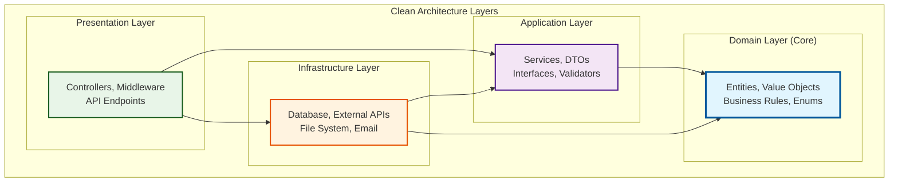

# E-Commerce API - System Architecture

## 📖 Overview

This document describes the architecture and design decisions for the E-Commerce API project. The system is built using **Clean Architecture** principles with **.NET 8**, focusing on maintainability, testability, and scalability.

## 🎯 Architecture Goals

### Primary Objectives
- **Separation of Concerns** - Each layer has distinct responsibilities
- **Dependency Inversion** - High-level modules don't depend on low-level modules
- **Testability** - Easy to unit test business logic in isolation
- **Maintainability** - Changes in one layer don't affect others
- **Scalability** - Architecture supports horizontal and vertical scaling

### Design Principles Applied
- **SOLID Principles** - Single Responsibility, Open/Closed, Liskov Substitution, Interface Segregation, Dependency Inversion
- **DRY (Don't Repeat Yourself)** - Reusable components and services
- **KISS (Keep It Simple, Stupid)** - Simple, understandable solutions
- **YAGNI (You Aren't Gonna Need It)** - Focus on current requirements

## 🏗️ Architecture Overview

The system implements **Clean Architecture** with four distinct layers, each with specific responsibilities and dependencies flowing inward only.

### Dependency Rule
> **Source code dependencies can only point inwards.** Nothing in an inner circle can know anything about something in an outer circle.

This means:
- **Domain** depends on nothing
- **Application** depends only on Domain
- **Infrastructure** depends on Application and Domain
- **Presentation** depends on Application and Infrastructure

## 💼 Business Context

### Problem Domain
The E-Commerce API serves as the backend for an online shopping platform, handling:

- **User Management** - Registration, authentication, profile management
- **Product Catalog** - Product CRUD, search, categorization
- **Inventory Management** - Stock tracking, availability checks
- **Authorization** - Role-based access control (Admin/Customer)

### Key Business Rules
1. **Authentication Required** - Protected endpoints need valid JWT tokens
2. **Role-Based Access** - Only admins can manage products
3. **Unique Constraints** - Email addresses and SKUs must be unique
4. **Stock Management** - Cannot sell more than available inventory
5. **Data Integrity** - All operations maintain referential integrity

## 🔧 Technology Stack

### Core Technologies
- **.NET 8** - Latest long-term support version
- **ASP.NET Core** - Cross-platform web framework
- **Entity Framework Core** - Object-relational mapping
- **SQL Server** - Primary data store

### Supporting Libraries
- **JWT Bearer Authentication** - Stateless authentication
- **AutoMapper** - Object-to-object mapping
- **FluentValidation** - Input validation
- **BCrypt.Net** - Password hashing
- **Swagger/OpenAPI** - API documentation

### Development Tools
- **xUnit** - Unit testing framework
- **Moq** - Mocking framework for tests
- **FluentAssertions** - Expressive test assertions
- **Entity Framework In-Memory** - Test database provider

## 📋 Requirements Fulfilled

### Functional Requirements ✅
- [x] User registration and authentication
- [x] JWT-based authorization
- [x] Product CRUD operations
- [x] Product search and filtering
- [x] Role-based access control
- [x] Input validation
- [x] Error handling

### Non-Functional Requirements ✅
- [x] Clean, maintainable code architecture
- [x] Comprehensive unit and integration tests
- [x] API documentation with OpenAPI/Swagger
- [x] Database design with proper relationships
- [x] Security best practices implementation
- [x] Performance optimization strategies

### Assessment Criteria Met ✅
- [x] **Code Quality** - Clean Architecture, SOLID principles
- [x] **Functionality** - All endpoints working correctly
- [x] **RESTful Design** - Proper HTTP methods and status codes
- [x] **Security** - JWT authentication and authorization
- [x] **Documentation** - Complete API and architecture docs
- [x] **Testing** - Unit tests demonstrating TDD approach

---

*The following sections provide detailed explanations of each architectural layer, design patterns used, and technical implementation decisions.*